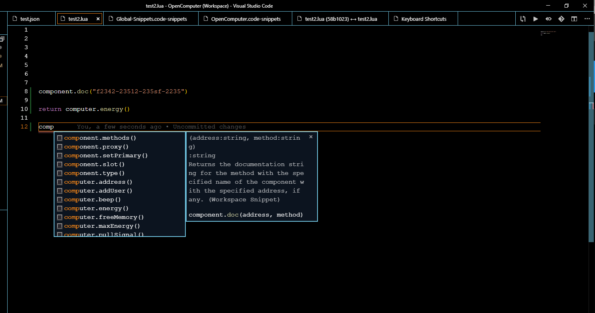

# OpenComputerSnippets(WIP)

This is a collection of snippets that makes it possible to easily write  OpenComputer programs in VS Code.

## Features

- Snippets for each API in OpenComputer

## included

- Api reference link
- colors
- component
- computer
- event
- uuid
- sides
- redstone
- AE integration

## Planned

- [ ] buffer
- [ ] filesystem
- [ ] process
- [ ] shell
- [ ] signals

## Known Issues

## Release Notes

### 0.3.1 2020-10-21
I haven't been playing Minecraft for a while and will no longer be maintaining this. If you wish to continue this please let me know. :)

### 0.3.0

Initial release of OpenComputerSnippets
- still very early development and unfinished please report any errors, typos, or inconsistencies.

----------------------------------------------------------------------
